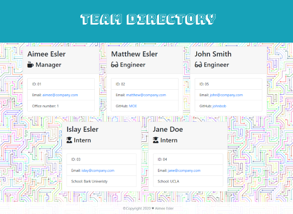
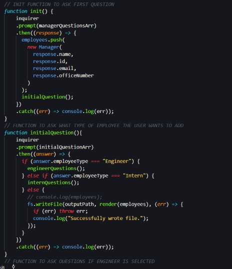
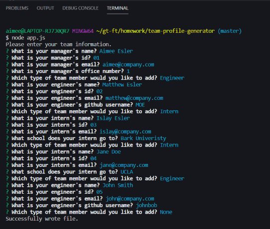

# Team Profile Generator

This repository consists of a command line application that creates a Team webpage with a profile for each employee based on the user's input.

---

## Table of Contents

- [Installation](#installation)
- [Usage](#Usage)
- [Building the Team Profile Generator](#building-the-team-profile-generator)
- [Minimum Requirements](#minimum-requirements)
- [Credits](#credits)
- [Resources](#resources)
- [Links](#Links)
- [License](#license)

---

## Installation

1. Follow the GitHub Repository Link in the [Links](#Links) section below.
1. Clone the repository using an SSH key.
1. Open GitBash and use "git clone" to clone the repository.
1. Run npm install to install associated modules.

---

## Usage

Edit using VSCode after [installation](#installation). JavaScript and package.json files are included.

---

## Building the Team Profile Generator

Upon opening the terminal for this application, the user must first run 'npm install' to download the required packages. After this, when the user runs the app.js file, they will be presented with a series of questions. The user can add as many employees as they wish, when they are done, they simply select the "None" option when prompted and their team.html file will be written. This file will contain the information provided by the user for each employee and will be sorted based on the employee type.

---

## Minimum Requirements

- Functional application. :heavy_check_mark:

- GitHub repository with a unique name and a README describing the project. :heavy_check_mark:

- User can use the CLI to generate an HTML page that displays information about their team. :heavy_check_mark:

- All tests must pass. :heavy_check_mark:

- Application must include all of the required classes. :heavy_check_mark:

- The project must prompt the user to build an engineering team. :heavy_check_mark:

- The project must generate a `team.html` page in the `output` directory, that displays a nicely formatted team roster. :heavy_check_mark:

---

## HTML Validation

The output from this application was run through the [W3C Markup Validation Service](https://validator.w3.org/) to ensure valid and correct HTML. There were no errors or issues found.

---

## Credits

As always, a huge thanks to our instructional staff for all their hard work!

## Resources

- [w3schools](https://www.w3schools.com)
- [Node.js](https://nodejs.org/en/)
- [Inquirer](https://www.npmjs.com/package/inquirer)
- [Background Image](https://pixabay.com/vectors/computer-cyber-circuitry-circuits-3163437/)

---

## Links

[Repository Link](https://github.com/aimeecesler/team-profile-generator)

[Demonstration Video](https://drive.google.com/file/d/1kLhxUjcHgLvysOqys87CA0C01n74hK8a/view)

---

## License

Copyright &copy; 2020 Aimee Corbin Esler

    Permission is hereby granted, free of charge, to any person obtaining a copy
    of this software and associated documentation files (the "Software"), to deal
    in the Software without restriction, including without limitation the rights
    to use, copy, modify, merge, publish, distribute, sublicense, and/or sell
    copies of the Software, and to permit persons to whom the Software is
    furnished to do so, subject to the following conditions:

    The above copyright notice and this permission notice shall be included in all
    copies or substantial portions of the Software.

    THE SOFTWARE IS PROVIDED "AS IS", WITHOUT WARRANTY OF ANY KIND, EXPRESS OR
    IMPLIED, INCLUDING BUT NOT LIMITED TO THE WARRANTIES OF MERCHANTABILITY,
    FITNESS FOR A PARTICULAR PURPOSE AND NONINFRINGEMENT. IN NO EVENT SHALL THE
    AUTHORS OR COPYRIGHT HOLDERS BE LIABLE FOR ANY CLAIM, DAMAGES OR OTHER
    LIABILITY, WHETHER IN AN ACTION OF CONTRACT, TORT OR OTHERWISE, ARISING FROM,
    OUT OF OR IN CONNECTION WITH THE SOFTWARE OR THE USE OR OTHER DEALINGS IN THE
    SOFTWARE.
